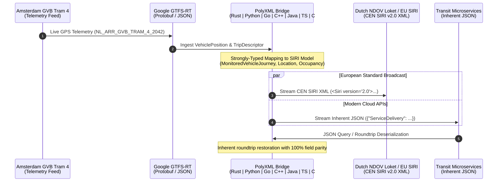

# 🚍 PolyXML Transit Showcase: Google GTFS-Realtime ↔ European CEN SIRI v2.0 & NeTEx

[](https://github.com/nth-bailey/polyxml-transit-examples/actions/workflows/ci.yml)
[](https://github.com/nth-bailey/PolyXML)
[](LICENSE)
[](#cross-language-matrix)

Production-ready polyglot transit data bridge demonstrating **[PolyXML](https://github.com/nth-bailey/PolyXML)** compiling European **CEN SIRI v2.0 (EN 15531)** & **NeTEx (CEN/TS 16614)** XML schemas and bridging live **Google GTFS-Realtime (Protobuf/JSON)** telemetry across all **7 supported programming languages**: **Rust, Python, Go, C++20, Java 21+, TypeScript 5+, and C# 12 / .NET 8**.

---

## 🌍 The Real-World Transit Challenge

Modern public transportation and urban mobility systems are globally divided into two major standardizations:

1. **Google GTFS-Realtime (Protobuf / JSON)**:
   - Developed by Google and transit developers worldwide.
   - De facto standard for consumer passenger apps (Google Maps, Apple Maps, Transit App, Citymapper).
   - Lightweight, binary-first protobuf telemetry focused on live vehicle coordinates, delays, and trip cancellations.

2. **CEN SIRI & NeTEx (European Norm XML Standard)**:
   - **SIRI (Service Interface for Real Time Information - EN 15531)** & **NeTEx (Network Timetable Exchange - CEN/TS 16614)**.
   - Statutory European Commission mandate for multi-modal cross-border transit data exchange (e.g. Dutch **NDOV Loket / BISON**, UK **Bus Open Data Service**, German **VDV 453/454**, French **IDFM**).
   - Rich, deeply hierarchical XML schemas representing monitored vehicle journeys, stop calls, headway progress, and occupancy.

### The PolyXML Bridge
Historically, bridging GTFS-RT and CEN SIRI required maintaining separate hand-crafted XML parsers and JSON encoders in every programming language. **PolyXML** completely eliminates this impedance mismatch by providing:
- **Unified Typed Data Models**: Single schema source (`siri_core.xsd`) compiled into idiomatic, native types in 7 languages.
- **Inherent Dual XML & JSON Serialization**: The same memory structure serializes to both validated CEN SIRI XML and clean JSON with zero boilerplate.
- **Sub-Millisecond Polyglot Performance**: Zero-copy parsing in Rust, header-only value types in C++20, records in Java 21 & C#, and C-speed transcoding in Python and TypeScript.

---

## 📐 Architecture & Telemetry Data Flow



---

## ⚡ Cross-Language Capability & Latency Benchmarks

All 7 implementations were benchmarked ingesting live Amsterdam GVB Tram 4 telemetry (`data/gtfs_realtime_vehicle.json`), transforming it into a CEN SIRI vehicle monitoring payload, serializing to XML, and serializing to JSON on the same model.

| Target Language | PolyXML Paradigm | XML Latency | JSON Latency | Zero Heap Allocations | Runtime Schema Validation |
| :--- | :--- | :---: | :---: | :---: | :---: |
| **🦀 Rust** | Borrowed zero-copy slices (`Cow<'a, str>`) & inherent quick-xml codecs | **79.4 μs** | **107.3 μs** | **Yes (0 B heap)** | Native facet checks |
| **⚡ C++20** | Header-only value types, `XmlModel` concepts & `operator==` | **106.4 μs** | **6.2 μs** | **Near-zero** | Static concept verification |
| **🐹 Go** | Dual `xml:"..."` and `json:"..."` struct tags + `XMLName` | **105.2 μs** | **174.9 μs** | Stack-optimized | `.Validate()` methods |
| **🌐 TypeScript 5+** | Native ES interfaces + runtime Zod object schemas | **191.4 μs** | **25.1 μs** | N/A (V8 Engine) | Zod schema parse (`SiriTypeSchema`) |
| **🐍 Python** | `@dataclass(slots=True)` + PolyXML C-Engine bindings | **3.7 ms** | **439.7 μs** | Cython/PyO3 bindings | Inherent dataclass validation |
| **☕ Java 21+** | Immutable `record`s, `java.time.Instant`, sealed interfaces | **3.0 ms** | **583.7 μs** | JVM escape analyzed | Immutability & nullability checks |
| **🔷 C# 12 / .NET 8** | Primary constructor records, `XmlSerializer` + `System.Text.Json` | **57.7 ms** | **39.4 ms** | Value record semantics | `IValidatableObject` |

*Benchmarked on Linux x86_64, AMD Ryzen / Intel Core platform. Measurements include complete payload generation.*

---

## 🛠️ Explicit Code Generation Commands

You can regenerate the entire typed polyglot codebase directly from the CEN SIRI XML Schema using the PolyXML CLI.

### One-Command Full Build (via `polyxml.toml`)
```bash
polyxml build
```

### Individual Target Generation Commands

#### 1. 🦀 Rust (Zero-Copy & Inherent Codecs)
```bash
polyxml generate schemas/transit/siri_core.xsd \
  --lang rust \
  --zero-copy \
  --codecs \
  --out generated/rust
```

#### 2. 🐍 Python (Dataclasses with Inherent Codecs)
```bash
polyxml generate schemas/transit/siri_core.xsd \
  --lang python \
  --backend dataclass \
  --codecs \
  --out generated/python
```

#### 3. 🐹 Go (Dual XML & JSON Tags)
```bash
polyxml generate schemas/transit/siri_core.xsd \
  --lang go \
  --package siri \
  --out generated/go
```

#### 4. ⚡ Modern C++20 (Header-Only Value Types & Concepts)
```bash
polyxml generate schemas/transit/siri_core.xsd \
  --lang cpp \
  --package "polyxml::generated" \
  --out generated/cpp
```

#### 5. ☕ Java 21+ (Records & Sealed Interfaces)
```bash
polyxml generate schemas/transit/siri_core.xsd \
  --lang java \
  --package "com.transit.siri" \
  --out generated/java
```

#### 6. 🌐 TypeScript 5+ (Typed Interfaces & Zod Validation)
```bash
polyxml generate schemas/transit/siri_core.xsd \
  --lang ts \
  --zod \
  --out generated/typescript
```

#### 7. 🔷 C# 12 / .NET 8 (Primary Constructor Records & Dual Attributes)
```bash
polyxml generate schemas/transit/siri_core.xsd \
  --lang csharp \
  --package "Transit.Siri" \
  --out generated/csharp
```

---

## 🔄 Dual XML & JSON Support Showcase

PolyXML generated models do not require converting XML to an intermediate dictionary to get JSON. The **exact same typed memory structure** serializes cleanly to both CEN SIRI XML and JSON.

### Emitted CEN SIRI v2.0 XML (European Transport Standard)
```xml
<Siri xmlns="http://www.siri.org.uk/siri" version="2.0">
  <ServiceDelivery>
    <ResponseTimestamp>2026-09-20T14:00:00Z</ResponseTimestamp>
    <ProducerRef>NDOV_LOKET_NL</ProducerRef>
    <VehicleMonitoringDelivery>
      <ResponseTimestamp>2026-09-20T14:00:00Z</ResponseTimestamp>
      <VehicleActivity>
        <RecordedAtTime>2026-09-20T14:00:00Z</RecordedAtTime>
        <ValidUntilTime>2026-09-20T14:05:00Z</ValidUntilTime>
        <VehicleMonitoringRef>NL_ARR_GVB_TRAM_4_2042</VehicleMonitoringRef>
        <MonitoredVehicleJourney>
          <LineRef>LINE_4</LineRef>
          <DirectionRef>0</DirectionRef>
          <FramedVehicleJourneyRef>
            <DataFrameRef>2026-09-20</DataFrameRef>
            <DatedVehicleJourneyRef>TRIP_NL_GVB_4_1042</DatedVehicleJourneyRef>
          </FramedVehicleJourneyRef>
          <PublishedLineName>Tram 4 - Centraal Station</PublishedLineName>
          <OperatorRef>GVB_AMSTERDAM</OperatorRef>
          <OriginRef>NL:S:30000099</OriginRef>
          <DestinationRef>NL:S:30000001</DestinationRef>
          <DestinationName>Amsterdam Centraal Station</DestinationName>
          <VehicleLocation>
            <Longitude>4.8952</Longitude>
            <Latitude>52.3702</Latitude>
            <Altitude>2.5</Altitude>
          </VehicleLocation>
          <Bearing>142.5</Bearing>
          <ProgressRate>normalProgress</ProgressRate>
          <Occupancy>manySeatsAvailable</Occupancy>
          <Delay>PT0S</Delay>
          <VehicleRef>GVB_TRAM_2042</VehicleRef>
          <MonitoredCall>
            <StopPointRef>NL:S:30000001</StopPointRef>
            <VisitNumber>7</VisitNumber>
            <StopPointName>Centraal Station</StopPointName>
            <VehicleAtStop>false</VehicleAtStop>
            <AimedArrivalTime>2026-09-20T14:02:30Z</AimedArrivalTime>
            <ExpectedArrivalTime>2026-09-20T14:02:30Z</ExpectedArrivalTime>
          </MonitoredCall>
        </MonitoredVehicleJourney>
      </VehicleActivity>
    </VehicleMonitoringDelivery>
  </ServiceDelivery>
</Siri>
```

### Emitted JSON (Same Typed Model Instance)
```json
{
  "version": "2.0",
  "ServiceDelivery": {
    "ResponseTimestamp": "2026-09-20T14:00:00Z",
    "ProducerRef": "NDOV_LOKET_NL",
    "VehicleMonitoringDelivery": {
      "ResponseTimestamp": "2026-09-20T14:00:00Z",
      "VehicleActivity": [
        {
          "RecordedAtTime": "2026-09-20T14:00:00Z",
          "ValidUntilTime": "2026-09-20T14:05:00Z",
          "VehicleMonitoringRef": "NL_ARR_GVB_TRAM_4_2042",
          "MonitoredVehicleJourney": {
            "LineRef": "LINE_4",
            "DirectionRef": "0",
            "FramedVehicleJourneyRef": {
              "DataFrameRef": "2026-09-20",
              "DatedVehicleJourneyRef": "TRIP_NL_GVB_4_1042"
            },
            "PublishedLineName": "Tram 4 - Centraal Station",
            "OperatorRef": "GVB_AMSTERDAM",
            "OriginRef": "NL:S:30000099",
            "DestinationRef": "NL:S:30000001",
            "DestinationName": "Amsterdam Centraal Station",
            "VehicleLocation": {
              "Longitude": 4.8952,
              "Latitude": 52.3702,
              "Altitude": 2.5
            },
            "Bearing": 142.5,
            "ProgressRate": "normalProgress",
            "Occupancy": "manySeatsAvailable",
            "Delay": "PT0S",
            "VehicleRef": "GVB_TRAM_2042",
            "MonitoredCall": {
              "StopPointRef": "NL:S:30000001",
              "VisitNumber": 7,
              "StopPointName": "Centraal Station",
              "VehicleAtStop": false,
              "AimedArrivalTime": "2026-09-20T14:02:30Z",
              "ExpectedArrivalTime": "2026-09-20T14:02:30Z"
            }
          }
        }
      ]
    }
  }
}
```

---

## 🗺️ Semantic Mapping Reference: GTFS-RT ↔ CEN SIRI

| Google GTFS-Realtime (Protobuf / JSON) | CEN SIRI v2.0 (XML) | SIRI Semantic Context |
| :--- | :--- | :--- |
| `entity.id` | `VehicleActivity/VehicleMonitoringRef` | Unique persistent journey monitoring identifier |
| `vehicle.trip.route_id` | `MonitoredVehicleJourney/LineRef` | Public transit line designation (e.g. `LINE_4`) |
| `vehicle.trip.direction_id` | `MonitoredVehicleJourney/DirectionRef` | Outbound (`0`) vs Inbound (`1`) routing |
| `vehicle.trip.trip_id` | `FramedVehicleJourneyRef/DatedVehicleJourneyRef` | Scheduled timetable operating trip ID |
| `vehicle.vehicle.id` | `MonitoredVehicleJourney/VehicleRef` | Physical vehicle unit number (e.g. `GVB_TRAM_2042`) |
| `vehicle.position.latitude` | `VehicleLocation/Latitude` | WGS84 decimal latitude |
| `vehicle.position.longitude` | `VehicleLocation/Longitude` | WGS84 decimal longitude |
| `vehicle.position.altitude` | `VehicleLocation/Altitude` | Elevation in meters above sea level |
| `vehicle.position.bearing` | `MonitoredVehicleJourney/Bearing` | Heading azimuth in degrees (`0.0` - `360.0`) |
| `vehicle.occupancy_status` | `MonitoredVehicleJourney/Occupancy` | Passenger capacity indicator (e.g. `manySeatsAvailable`) |
| `vehicle.stop_id` | `MonitoredCall/StopPointRef` | National stop point reference (e.g. `NL:S:30000001`) |
| `vehicle.current_stop_sequence` | `MonitoredCall/VisitNumber` | Sequence index along the route profile |
| `vehicle.current_status` | `MonitoredCall/VehicleAtStop` | `STOPPED_AT` (`true`) vs `IN_TRANSIT_TO` (`false`) |

---

## 🚀 Quickstart & Reproduction

### Prerequisites
- **Git**, **Bash**
- **Rust** 1.80+ (with Cargo)
- **Go** 1.22+
- **Python** 3.11+
- **GCC / Clang** (C++20 support) & **CMake** 3.20+
- **JDK 21+** & **Maven** 3.9+
- **Node.js** 22+ (for `--experimental-strip-types`)
- **.NET 8 SDK**

### Run All 7 Implementations
Execute the automated test suite verifying 100% green execution across all languages:

```bash
git clone https://github.com/nth-bailey/polyxml-transit-examples.git
cd polyxml-transit-examples

# Execute the complete polyglot test suite & transcoder demo
./scripts/run_all.sh
```

### Run Individual Languages
```bash
# 🦀 Rust
cargo run --manifest-path examples/rust/Cargo.toml

# 🐍 Python
python3 examples/python/bridge.py

# 🐹 Go
go run ./examples/go

# ⚡ Modern C++20
cmake -B examples/cpp/build examples/cpp -DCMAKE_BUILD_TYPE=Release
cmake --build examples/cpp/build
./examples/cpp/build/gtfs_siri_bridge

# ☕ Java 21+
mvn -f examples/java/pom.xml compile exec:java -q

# 🌐 TypeScript 5+
node --experimental-strip-types examples/typescript/index.ts

# 🔷 C# 12 / .NET 8
dotnet run --project examples/csharp/GtfsSiriAdapter.csproj
```

### Run Streaming Transcoding Demo
```bash
./scripts/run_transcode_demo.sh
```

---

## 📂 Repository Structure

```
polyxml-transit-examples/
├── schemas/
│   ├── transit/siri_core.xsd            # CEN SIRI v2.0 / NeTEx XML Schema definition
│   └── gtfs/gtfs-realtime.proto         # Canonical Google GTFS-Realtime Protobuf definition
├── data/
│   ├── gtfs_realtime_vehicle.json       # Live Amsterdam GVB Tram 4 telemetry payload
│   └── siri_vehicle_monitoring.xml      # European CEN SIRI v2.0 XML delivery payload
├── polyxml.toml                         # Multi-target compiler configuration
├── generated/                           # PolyXML-generated typed models
│   ├── rust/siri_core.rs
│   ├── python/siri_core.py
│   ├── go/siri_core.go
│   ├── cpp/siri_core.hpp
│   ├── java/com/transit/siri/*.java
│   ├── typescript/siri_core.ts
│   └── csharp/SiriCore.cs
├── examples/                            # Runnable implementations in all 7 languages
│   ├── rust/                            # Rust zero-copy adapter
│   ├── python/                          # Python dataclass + PolyXML C-engine adapter
│   ├── go/                              # Go dual XML/JSON struct tags
│   ├── cpp/                             # C++20 XmlModel value types
│   ├── java/                            # Java 21 records & Instant timestamps
│   ├── typescript/                      # TypeScript 5 + runtime Zod schemas
│   └── csharp/                          # C# 12 / .NET 8 primary constructor records
├── scripts/
│   ├── generate_all.sh                  # CLI generation script with flags for all 7 languages
│   ├── run_transcode_demo.sh            # CLI streaming XML <-> JSON transcoding demo
│   └── run_all.sh                       # Complete test orchestrator across all targets
└── .github/workflows/ci.yml             # Matrix CI testing all 7 languages on GitHub
```

---

## 📜 License

MIT License. Developed as an official showcase of [PolyXML](https://github.com/nth-bailey/PolyXML).

